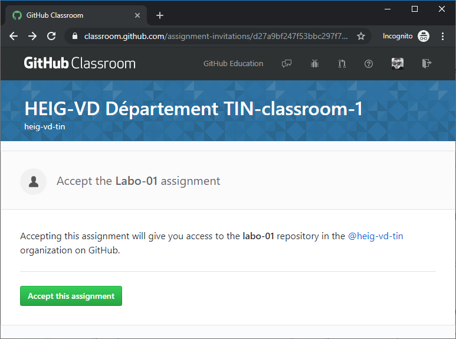
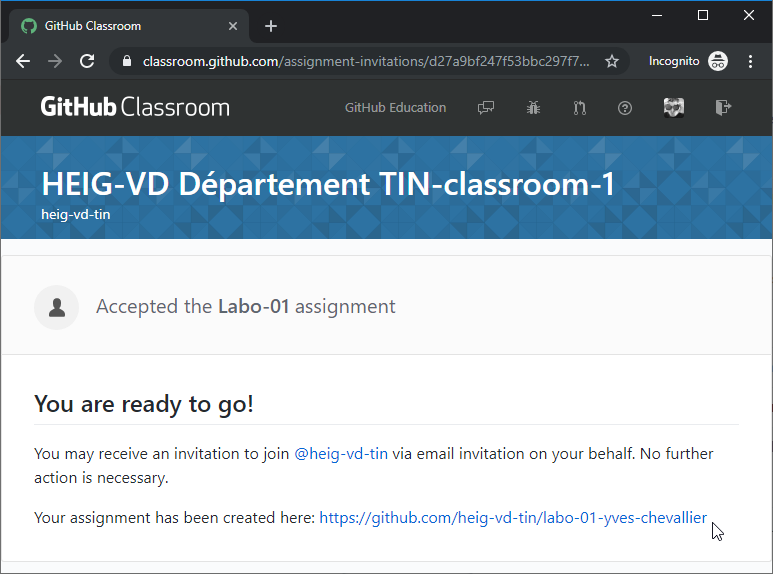
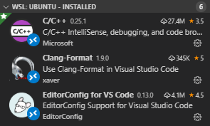
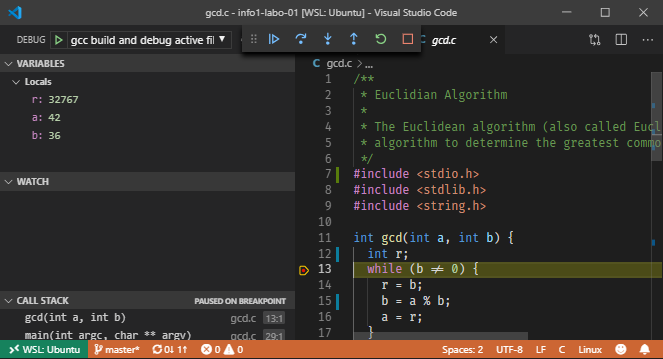

# 👋 Laboratoire 01 - Premiers pas

| Type       | Description                        |
| ---------- | ---------------------------------- |
| Durée      | 2x45 minutes + Travail à la maison |
| Rendu      | Sur GitHub                         |
| Format     | Travail individuel                 |
| Évaluation | Sur la fonctionnalité du code      |

Le but de ce travail pratique est la prise en main de l'environnement de développement installé précédemment et la compilation de votre premier programme. Plus nous avancerons dans les travaux pratiques, moins vous serez guidé. Pour l'heure, avançons pas à pas...

À la fin de ce travail pratique vous serez en mesure de :

- récupérer les fichiers sources d'un travail pratique depuis GitHub (*clone*) ;
- apporter vos modifications, ajouter des fichiers ;
- soumettre vos changements sur GitHub ;
- compiler votre programme ;
- le tester ;
- comprendre les différents fichiers constituant un projet d'Info1.

## :octocat: Accès au travail pratique

Pour ce cours nous utilisons le portail *GitHub Classroom* permettant de distribuer des travaux pratiques aux étudiants s'exerçant à la programmation. La première étape consiste donc à récupérer l'adresse du devoir que vous avez reçu de votre professeur (sans doute par Teams). Vous avez joint le travail (*assignment*) en cliquant sur le lien fourni :



Lors de cette opération, une copie du référentiel d'origine est créée avec votre nom. Ce processus de copie s'appelle *fork* (fourchette), cela crée un point d'embranchement entre le laboratoire de référence et votre propre copie que vous pourrez modifier à souhait. Dès lors, vous disposerez d'un espace personnel dans lequel vous pourrez apporter vos propres modifications. C'est votre version publiée sous GitHub qui sera utilisée pour l'évaluation du laboratoire.

Après avoir joint le travail, vous pouvez vous rendre sur GitHub, dans votre espace de travail



Depuis GitHub, vous avez un bouton vert permettant de copier le lien du chemin permettant de modifier votre référentiel.


Vous avez ici le choix entre deux protocoles de communication `HTTPS` et `GIT` + `SSH`. La première variante utilisera vos identifiants de connexion (login et mot de passe) qui vous seront demandés à chaque opération. La deuxième variante utilisera un canal sécurisé en utilisant la clé SSH que vous avez créé lors du précédent labo (cela vous évite en outre de devoir taper votre mot de passe).

## 💻 Clone du référentiel

Lors du travail précédent, nous avons installé le programme [Git](https://git-scm.com/docs/git-clone/fr). Il s'agit d'un outil très utilisé par les programmeurs pour suivre l'évolution d'un code source. C'est un outil de gestion de version. GitHub n'est qu'un portail collaboratif pour les utilisateurs de Git.

Pour récupérer votre projet, ouvrez une console **WSL** et faites un clone du référentiel en utilisant le lien copié plus haut. Voici l'exemple avec mon propre lien :

```console
$ git clone https://github.com/heig-vd-tin/labo-01-yves-chevallier.git
Cloning into 'labo-01-yves-chevallier'...
remote: Enumerating objects: 8, done.
remote: Counting objects: 100% (8/8), done.
remote: Compressing objects: 100% (8/8), done.
remote: Total 8 (delta 0), reused 0 (delta 0), pack-reused 0
Unpacking objects: 100% (8/8), done.
```

Il faut voir deux informations dans cet exemple ci-dessus. D'une part la commande entrée dans le terminal qui suit directement le prompt (`$`). Et d'autre part le dernier mot fourni par la commande : `done`. Il indique en général que tout s'est passé correctement et qu'il est inutile d'aller contrôler le reste de la sortie.

Rendez-vous ensuite dans le répertoire en utilisant la commande `cd` pour *change directory* :

```console
$ cd labo-01-yves-chevallier
```

> **Note**
> il vous suffit de faire `cd lab<tab><tab>` pour compléter automatiquement le reste du texte. C'est très pratique lorsque vous avez des noms de répertoires longs.

Depuis cette étape vous pouvez exécuter Visual Studio Code. N'oubliez pas le point `.` après le nom de la commande, il signifie *le répertoire courant* :

```console
$ code .
```

> La commande reçoit en argument la chaîne de caractère `.`. La commande ouvre donc VS Code dans le répertoire courant, celui du projet.

Visual Studio Code est démarré dans Windows puis connecté à votre WSL par le biais d'une connexion à distance (*remote connection*). En bas à gauche de la fenêtre de Visual Studio Code vous pouvez constater un petit logo vert indiquant l'état de la connexion à distance avec WSL :


*NOTE* : Si vous ne parvenez pas à obtenir cette connexion, c'est sans doute qu'il vous manque l'extension `WSL`. Installer cette extension depuis le menu `Extensions` de Visual Studio Code, puis redémarrer Visual Studio Code.

Travailler en connexion à distance vous permet d'exécuter toutes les commandes Linux depuis Windows. C'est très pratique pour rester compatible avec l'environnent normalisé **POSIX** qui n'est pas disponible depuis Windows seul.

## Installation des extensions

Pour disposer de tout l'arsenal de développent en C/C++ il est nécessaire d'installer des extensions à votre éditeur Visual Studio si ce n'est pas déjà fait. Visual Studio Code est un outil très polyvalent et de nombreuses extensions ajoutant des fonctionnalités peuvent être installées au gré des besoins. Le raccourci `<CTRL>+<MAJ>+<X>` permet d'ouvrir le panneau d'installation des extensions. On vous propose l'installation des extensions suivantes :



**C/C++** Permet de mieux interagir avec du code C, il permet de s'interfacer avec un débogueur, d'avoir de l'autocomplétion de code et un correcteur interactif de syntaxe.

**Clang-Format** Permet d'automatiquement formater le code source, c'est à dire convenablement aligner les différentes lignes du code selon un standard prédéfini.

**EditorConfig** Permet de configurer certaines options propres à chaque type de fichier (nombre de tabulation, type d'encodage, type de fin de ligne, etc.)

Le raccourci `<CTRL>+<MAJ>+<E>` permet de revenir à l'arborescence de travail.

## 📁 Familiarisation avec la structure des fichiers

Prenez connaissance de la structure des fichiers du labo ci-dessous. Vous pouvez obtenir ce type d'arborescence avec le programme `tree` depuis WSL.

```text
.
├── Makefile        # Les directives de compilation
├── README.md       # La donnée du laboratoire au format Markdown
├── assets          # Les images associées au README
├── gcd.c           # Le programme C à compléter / corriger
├── criteria.yml    # Les critères d'évaluation du travail
└── test            # Les éventuels tests du laboratoire
    └── test.sh     # Le test du programme gcd.c
```

Pour l'instant, le seul fichier qui nous intéresse c'est `gcd.c`. Votre travail c'est de corriger ce programme et de le compiler.

## Compilation

Depuis la console, essayer de compiler votre programme en utilisant le compilateur `gcc`. Vous constaterez quelques erreurs :

```bash
$ gcc gcd.c
gcd.c: In function ‘gcd’:
gcd.c:13:5: error: ‘r’ undeclared (first use in this function)
     r = b;
     ^
gcd.c:13:5: note: each undeclared identifier is reported only once for each function it appears in
gcd.c: In function ‘main’:
gcd.c:30:5: warning: implicit declaration of function ‘printf’ [-Wimplicit-function-declaration]
     printf("%d\n", result + 5);
     ^~~~~~
gcd.c:30:5: warning: incompatible implicit declaration of built-in function ‘printf’
gcd.c:30:5: note: include ‘<stdio.h>’ or provide a declaration of ‘printf’
gcd.c:33:1: error: expected ‘;’ before ‘}’ token
```

Votre but c'est bien naturellement de corriger ces erreurs. Les étapes sont donc :

1. Essayer de compiler ;
2. Corriger le programme, le sauver ;
3. Retour à (1) si échec.

## 🏗 Compilation automatique

Habituellement on n'utilise pas `gcc` directement, on ajoute des **options de compilation**. Certaines options comme `-std=c11` permettent de dire au compilateur d'utiliser le standard **C11**. Pour simplifier la compilation, le développeur écrit un fichier nommé *Makefile* qui contient toute la procédure de compilation.

Pour **Info1**, il ne vous sera jamais demandé d'écrire un *Makefile* par contre, il est essentiel que vous puissiez en utiliser un.

Pour l'utiliser, exécuter simplement le programme `make` dans un répertoire qui contient un `Makefile` :

```bash
$ make
cc -std=c11 -Wall -Werror gcd.c -o gcd
test/test.sh /mnt/c/Users/yves.chevalli/Dropbox/work/heig-vd/teaching/info/laboratories/info1-labo-01/gcd
Makefile:10: recipe for target 'test' failed
make: *** [test] Error 1
```

Vous constatez que le programme s'est bien compilé, mais qu'une erreur est apparue à la recette `test`. C'est-à-dire que le programme de test n'a pas fonctionné. Cherchons donc à savoir pourquoi.

Si l'on exécute le programme compilé avec `./` devant le nom du programme, vous obtenez ceci :

```bash
$ ./gcd 12 6
11
```

C'est étrange, le programme retourne 11 alors que le plus grand diviseur commun devrait être 6. Il doit y avoir un autre problème dans le programme.

Saurez-vous le trouver ?

## Debug depuis Visual Studio Code

Pour de petits programmes, compiler manuellement ou via un *Makefile* est une très bonne solution, mais pour de très gros programmes il existe d'autres techniques.

La première étape est de vous assurer que vous avez bien un débogueur installé sur votre système. Depuis le terminal (`<C-j>`) tentez d'installer `gdb` (GNU Debugger) avec:

```console
$ sudo apt install gdb
```

Dès à présent, depuis Visual Studio Code, vous pouvez utiliser le raccourci `<F5>` lorsque vous éditez le programme `gcd.c` pour lancer le débogueur. Essayez :

1. Ouvrir le fichier `gcd.c`
2. Cliquez à gauche de la ligne 12 (`int r;`), un point rouge apparaît. Il s'agit d'un *breakpoint*
3. Lancer votre programme avec `<F5>`
4. En utilisant `<F11>` vous pouvez avancer dans votre programme et constater la valeur des différentes variables `a`, `b`, `r`, ...



Vous pouvez naturellement créer d'autres `breakpoints` si vous le désirez. Pour interrompre le debug utilisez `<SHIFT>+<F5>`. Utilisez `<CTRL>+<SHIFT>+<E>` pour revoir l'explorateur de code.

## Annotation de votre programme

Pour être bien certain que vous avez compris votre premier programme, il vous est demandé d'annoter chaque ligne avec un commentaire expliquant ce que chacune fait. Voici un exemple :

```c
#include <stdlib.h> // Inclus la bibliothèque stdlib pour pouvoir utiliser la fonction `atoi`

int gcd(int a, int b) { // Déclare la fonction gcd qui prend en paramètre 2 entiers a et b et retourne un entier
  int r; // Déclare une variable `r` qui est le reste de la division
```

Si vous souhaitez être plus précis, vous pouvez utiliser les commentaires multilignes :

```c
/*
Ceci est un commentaire multiligne
pour expliquer des choses plus longues
...
...
*/
```

Si vous ne comprenez pas bien certaines lignes de code, essayez de chercher la réponse sur internet, sinon demandez autour de vous.

## Commit de vos changements

Une fois que vous avez terminé les étapes suivantes :

1. corriger le programme ;
2. vérifié que les tests fonctionnent et
3. annoté le programme comme demandé.

Vous pouvez ensuite valider vos changements avec `git`

```console
$ git commit -am "Fix bugs + add comments"
[master abde12] Fix bugs + add comments
 1 file changed, 140 insertions(+), 1 deletion(-)
 create mode 100644 gcd.c
```

L'option `-a` demande à Git de tenir compte de toutes les modifications `all`, et l'option `-m` indique que l'argument qui suit est le commentaire associé à cet ensemble de modifications. La norme POSIX permet de concaténer les options `-am`.

Si la commande ne fonctionne pas chez vous, c'est que vous n'avez probablement pas configuré votre environnent Git convenablement et que vous avez oublié soit :

1. De saisir vos identifiants :
    ```console
    git config --global user.name "Emmet Lathrop Brown"
    git config --global user.email emmet.brown@heig-vd.ch
    ```
2. De mettre votre clé SSH sur GitHub

## 📌 Push de vos changements

Une fois le commit effectué, il faut encore soumettre vos changements sur GitHub, ceci s'effectue avec la commande `git push`

```console
$ git push
Counting objects: 25, done.
Delta compression using up to 8 threads.
Compressing objects: 100% (22/22), done.
Writing objects: 100% (25/25), 197.60 KiB | 2.53 MiB/s, done.
Total 25 (delta 4), reused 0 (delta 0)
remote: Resolving deltas: 100% (4/4), done.
To github.com:heig-vd-tin/info1-labo-01.git
   dd54203..e8d278e  master -> master
```

À présent vous pouvez retourner sur GitHub pour vérifier que votre rendu de labo est bel et bien présent.

## 🛈 Quelques fonctionnalités de Visual Studio Code

Si vous souhaitez être plus efficace dans l'écriture de programmes, vous devez connaître deux commandes dans Visual Studio Code :

1. `<CTRL> + P` Navigation rapide entre fichiers
2. `<CTRL> + <SHIFT> + P` Exécution de commandes
3. `<CTRL> + B` Afficher/cacher l'explorateur de fichiers.

La première commande permet de facilement naviguer dans les fichiers apparaissant dans l'explorateur de fichiers à gauche de la fenêtre. Une fois `<C-P>` entré, vous pouvez faire une *fuzzy search*, c'est-à-dire taper des caractères qui apparaissent dans l'ordre dans les noms des fichiers. Par exemple `<C-P> mi` sélectionne `Makefile` qui contient un `m` suivi plus tard d'un `i`.

La seconde commande permet d'exécuter d'autres commandes sur Visual Studio Code. Essayez par exemple d'ouvrir le fichier `README.md` (celui-ci) et de sélectionner les 6 lignes débutant avec des chiffres ci-dessous. Ensuite, choisissez `Sort` dans le menu apparaissant avec `<CTRL> + <SHIFT> + P`.

```text
1
5
6
3
2
4
```

## 🔎 Pour aller plus loin

Récapitulons, jusqu'ici nous avons utilisé les programmes suivants :

- `WSL` C'est le conteneur de données dans lequel tourne Linux
- `Ubuntu` C'est la distribution Linux que nous utilisons pour ce cours. C'est aussi la plus populaire.
- `Visual Studio Code` C'est un éditeur de code aussi nommé IDE.
- `gcc` C'est un programme : le compilateur C qui permet de transformer le code source en un programme exécutable
- `gdb` C'est un autre programme : le *GNU Debugger* permettant de stopper l'exécution d'un programme en cours pour lire l'état des variables interne.

Lorsque vous compilez votre programme avec la commande suivante :

```bash
$ gcc -g gcd.c -ogcd
```

Vous générez un exécutable `gcd` en ajoutant quelques informations de débogage utiles au débogueur.

Il faut savoir que le débogueur `gdb` peut être utilisé directement. Il était d'ailleurs utilisé à la main lorsque les IDE n'existaient pas (il y a 20 ans). Essayons pour voir avec `gdb --args gcd 36 6`

```console
$ gdb --args gcd 36 6
GNU gdb (Ubuntu 9.2-0ubuntu1~20.04) 9.2
Copyright (C) 2020 Free Software Foundation, Inc.
For help, type "help".
Type "apropos word" to search for commands related to "word"...
Reading symbols from gcd...
(gdb)
```

Vous êtes invité à taper une commande. Essayez `break 12` pour créer un breakpoint à la ligne 12 de votre code. C'est exactement ce qui se passe dans Visual Studio Code lorsque vous placez un rond rouge à la ligne 12.

```console
(gdb) break 12
Breakpoint 1 at 0x1177: file gcd.c, line 12.
```

Ensuite, lancer le programme :

```console
(gdb) run
Starting program: /home/canard/labo-01-first-steps/gcd 36 6

Breakpoint 1, gcd (a=36, b=6) at gcd.c:12
12        while (b != 0) {
```

L'exécution s'arrête comme prévu à la ligne 12. On peut constater que `a` vaut 36 et `b` vaut 6. Mais que vaut `r` ?

Pour obtenir cette information il faut dire au débogueur d'observer cette variable, par exemple avec `watch r`.

```console
(gdb) watch r
Hardware watchpoint 2: r
```

Pour avancer pas à pas, utiliser l'instruction `next`:

```console
(gdb) next
13          r = a % b;
(gdb) next

Hardware watchpoint 2: r

Old value = 32767
New value = 0
gcd (a=36, b=6) at gcd.c:14
14          a = b;
(gdb) next
15          b = r;
(gdb) next
12        while (b != 0) {
(gdb) next
17        return a;
(gdb) next
18      }
...
```

Enfin pour quitter le débogueur, utiliser `quit`.

Vous trouverez [ici](https://darkdust.net/files/GDB%20Cheat%20Sheet.pdf) d'autres commandes utiles.

En 2021, plus personne n'utilise `gdb` à la main. C'est néanmoins utile de comprendre comment les choses se passent *behind the scenes*...
